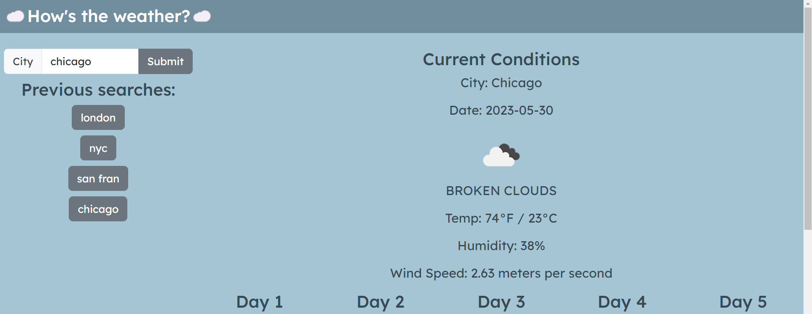

# Weather Dashboard

## Description

This project is a weather app that displays the weather in a given location when the user types a city into the search box. The page displays the current conditions along with a 5-day forecast. Enjoy!

## Installation

No install required! Simply access the page here: https://branchwag.github.io/weather-dashboard/

## Usage

Type in a city into the search bar on the left-hand side! The page should then populate with the weather stats, screenshot below!

## Credits

Columbia Coding Bootcamp

This application uses Bootstrap, link below:
https://getbootstrap.com/docs/5.3/getting-started/introduction/

This app uses the OpenWeather API to populate data:
https://openweathermap.org/forecast5

I would also like to credit a few articles that were helpful in creating this app, below:  

https://bobbyhadz.com/blog/javascript-get-element-by-id-contains  

https://www.freecodecamp.org/news/javascript-check-if-undefined-how-to-test-for-undefined-in-js/  

https://coding-boot-camp.github.io/full-stack/apis/how-to-use-api-keys  

https://codetogo.io/how-to-add-multiple-classes-to-element-in-javascript/

## License

MIT License

## How to Contribute

Follow the [Contributor Covenant](https://www.contributor-covenant.org/)!

## Tests

Input a variety of cities into the search box along with blank or invalid inputs. The app should handle invalid inputs with an alert message to adjust your input. Valid city locations should return populated weather data.
